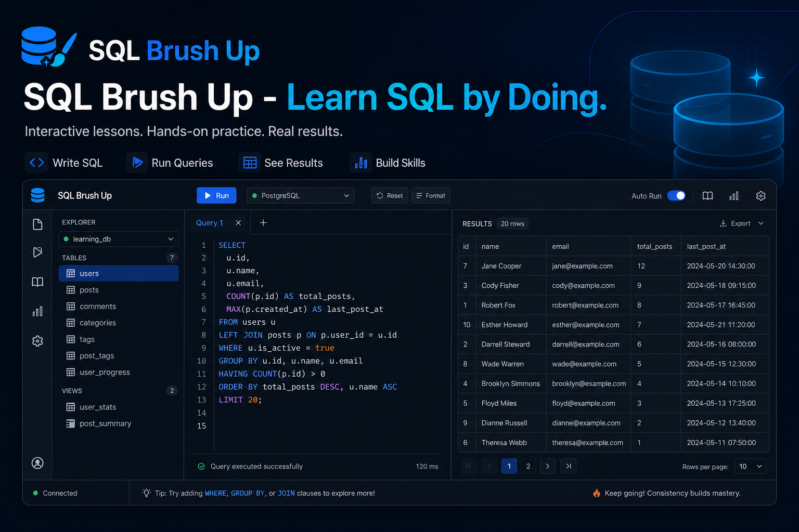
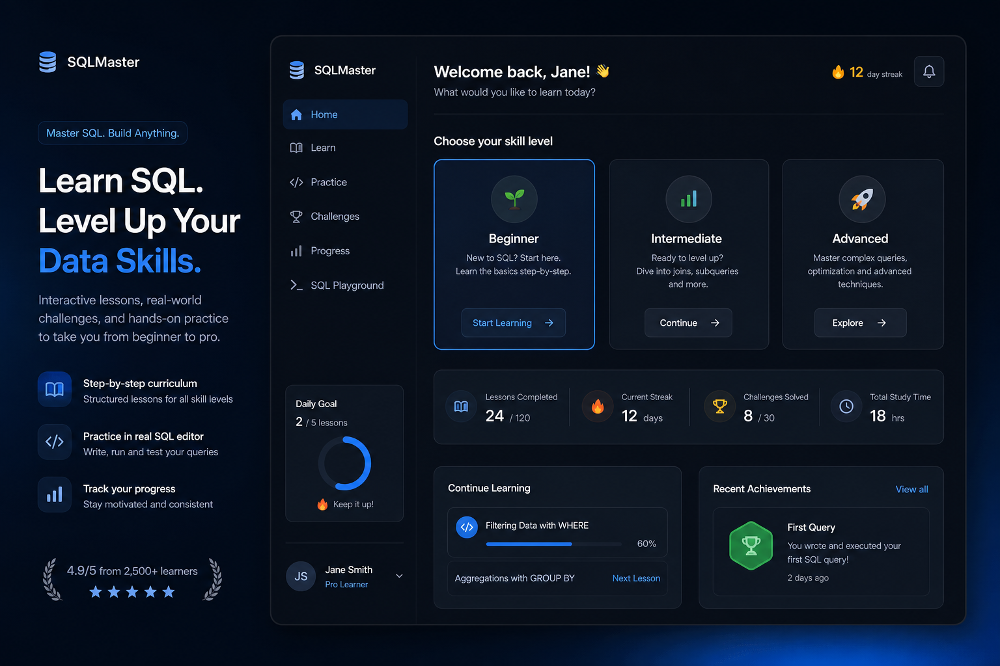
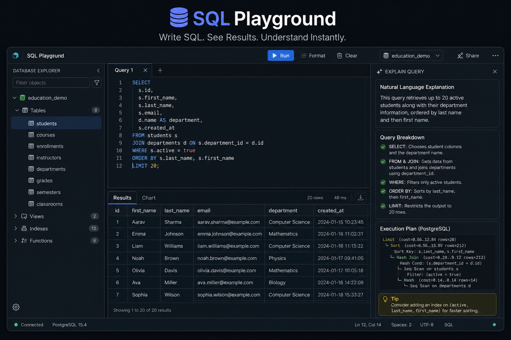
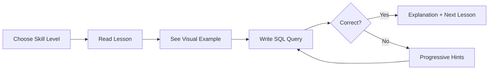

<div align="center">



<br /><br />

# SQL Brush Up

### **Learn SQL by Doing.**

*Not another SQL playground. Not another LeetCode clone.*  
*An interactive course that helps you **actually understand** SQL — by working with real databases.*

<br />

[](https://react.dev)
[](https://www.typescriptlang.org)
[](https://sql.js.org)
[](https://vitejs.dev)
[]()
[](LICENSE)

<br />

[**🚀 Live Demo**](#) · [**📖 Documentation**](#getting-started) · [**🛠️ Architecture**](docs/ARCHITECTURE.md) · [**🤝 Contribute**](#contributing)

</div>

---

## Why SQL Brush Up?

Most SQL tools let you **run queries**. SQL Brush Up helps you **understand** them.

| ❌ Traditional approach | ✅ SQL Brush Up |
|------------------------|----------------|
| Read dry documentation | Learn with analogies & visuals |
| Copy-paste from ChatGPT | Zero AI — deterministic logic only |
| Solve abstract puzzles | Practice on real-world databases |
| Get cryptic error messages | Friendly, educational error explanations |
| No idea *why* a query works | Step-by-step query visualization |

> **Built for students, freshers, career switchers, data analysts, and engineers preparing for interviews.**

---

## ✨ See It In Action

### Personalized Learning Path

Pick your skill level — Beginner, Intermediate, or Advanced — and get a tailored experience from day one.



<br />

### VS Code-Style SQL Playground

Three-panel layout: **Database Explorer** · **SQL Editor** · **Results & Explanation**



---

## 🎯 What You Can Do

<table>
<tr>
<td width="50%">

### 📚 Learn
- Beginner → Advanced curriculum
- Real-life analogies in every lesson
- Visual diagrams & table examples
- Interactive practice after each concept

</td>
<td width="50%">

### 🛠️ Build
- Create & manage databases
- Design tables with constraints
- Insert data manually or via CSV
- Import / export `.sqlite` files

</td>
</tr>
<tr>
<td width="50%">

### 🎮 Practice
- Challenges with progressive hints
- Smart result comparison (not text matching)
- Multiple valid solutions accepted
- Mistake detection with explanations

</td>
<td width="50%">

### 📈 Track
- Lesson completion progress
- Daily streak counter
- Query history & bookmarks
- Topics covered dashboard

</td>
</tr>
</table>

---

## 🗄️ 13 Ready-to-Use Sample Databases

Practice on realistic datasets — no setup required.

| Database | Best For | Tables |
|----------|----------|--------|
| 🎓 Student Management | SELECT, JOINs | 3 |
| 📚 Library | NULL handling, JOINs | 3 |
| 🏥 Hospital | Filtering, dates | 3 |
| 🎬 Movie Database | Many-to-many relations | 3 |
| 🏦 Bank | Aggregates, SUM/AVG | 3 |
| 🏛️ University | GROUP BY | 3 |
| 👥 HR | Project assignments | 3 |
| 🛒 E-Commerce | Multi-table JOINs | 4 |
| 🍽️ Restaurant | Reservations | 3 |
| 📦 Orders | Business queries | 3 |
| 💼 Employees | Self-joins, hierarchy | 3 |
| 🏭 Inventory | Stock across warehouses | 3 |
| 🌍 Northwind | Classic SQL dataset | 6 |

---

## 🧠 How Learning Works



### Hint System — Never Spoil the Answer

| Step | What you get |
|------|-------------|
| **Hint 1** | Concept explanation |
| **Hint 2** | Common mistake to avoid |
| **Hint 3** | Expected output description |
| **Final** | Full solution + explanation |

### Query Execution Visualizer

Watch your query execute step by step:

```
FROM students     →  Read the table
       ↓
WHERE age > 18    →  Filter each row
       ↓
SELECT name       →  Return matching columns
```

---

## 🏗️ Architecture

```
sql-brush-up/
├── client/          # React + TypeScript + Vite
│   ├── components/  # UI, playground, layout
│   ├── pages/       # Dashboard, lessons, playground
│   ├── services/    # sql.js engine, lesson engine
│   ├── lessons/     # JSON lesson content (data-driven)
│   └── sample-data/ # 13 sample database schemas
├── server/          # Express (local dev)
├── shared/          # Types, SQL utilities, tests
└── vercel.json      # One-click deploy config
```

**Key decision:** SQLite runs **in your browser** via WebAssembly (sql.js).  
No server database. No API keys. **Free forever on Vercel.**

→ [Full architecture docs](docs/ARCHITECTURE.md)

---

## 🚀 Getting Started

### Prerequisites

- **Node.js** 18+
- **npm** 9+

### Install & Run

```bash
# Clone the repository
git clone https://github.com/AshleyMathias/SQL-Learning-Platform.git
cd SQL-Learning-Platform

# Install dependencies
npm install

# Start development (client + server)
npm run dev
```

Open **http://localhost:5173** — no login, no API keys, no setup.

### Build for Production

```bash
npm run build
npm run preview
```

### Run Tests

```bash
npm test
```

---

## ☁️ Deploy to Vercel (Free)

1. Fork or push this repo to GitHub
2. Import at [vercel.com/new](https://vercel.com/new)
3. Deploy — **zero environment variables needed**

```bash
npx vercel --prod
```

Everything runs client-side. Fast globally. No ongoing costs.

---

## ⌨️ Keyboard Shortcuts

| Shortcut | Action |
|----------|--------|
| `Ctrl + Enter` | Run query |
| `Ctrl + /` | Toggle comment |
| `Ctrl + S` | Save query |

---

## 🛡️ Built for Reliability

- SQL errors **never crash** the app
- Destructive queries require **confirmation**
- 10,000+ row results stay **fast** (virtualized tables)
- SQLite limitations are **explained** (e.g. no RIGHT JOIN)
- Lesson content is **JSON-driven** — easy to extend
- **Zero AI** — 100% deterministic, works offline

---

## 🤝 Contributing

We welcome contributions! See [Development Guide](docs/DEVELOPMENT.md).

1. Fork the repo
2. Create a feature branch
3. Add lessons in `client/src/lessons/lessons.json`
4. Add sample DBs in `client/src/sample-data/`
5. Run `npm test`
6. Open a Pull Request

---

## 📄 License

MIT © [Ashley Mathias](https://github.com/AshleyMathias)

---

<div align="center">

**Stop reading about SQL. Start understanding it.**

<br />

[⭐ Star this repo](https://github.com/AshleyMathias/SQL-Learning-Platform) · [🐛 Report a bug](https://github.com/AshleyMathias/SQL-Learning-Platform/issues) · [💡 Request a feature](https://github.com/AshleyMathias/SQL-Learning-Platform/issues)

<br />

*Made with care for learners everywhere.*

</div>
