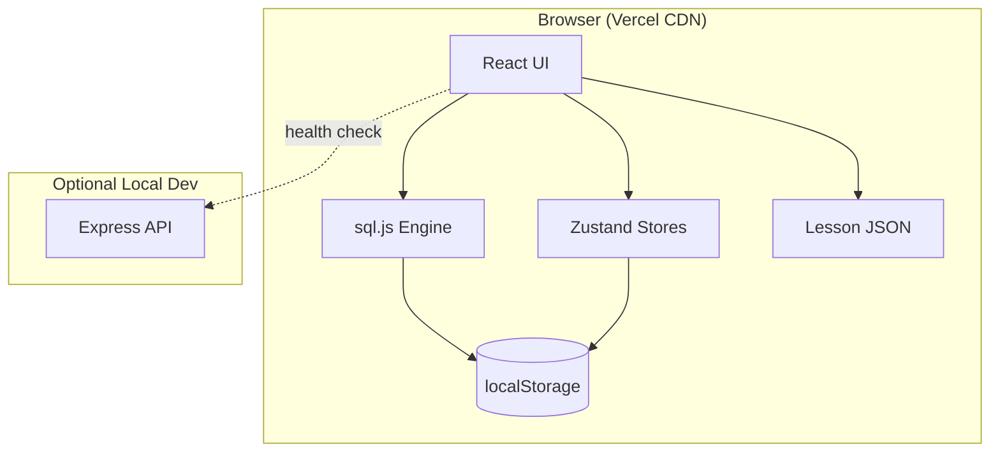

# Architecture

## System Overview



## Layer Separation

| Layer | Location | Responsibility |
|-------|----------|----------------|
| **UI** | `client/src/components`, `pages` | Rendering, user interaction |
| **State** | `client/src/stores` | Preferences, progress, bookmarks |
| **SQL Engine** | `client/src/services/database` | Execute queries, schema introspection |
| **Lesson Engine** | `client/src/services/lessons` | Load and search lesson content |
| **Shared Logic** | `shared/src/utils` | Error classification, result comparison |
| **Content** | `client/src/lessons`, `sample-data` | Data-driven, not hardcoded in components |

## Vercel Deployment Strategy

SQL Brush Up deploys as a **static SPA** on Vercel's free tier:

1. **No server-side database** — SQLite runs in-browser via sql.js (WebAssembly)
2. **No API keys or env vars** — zero configuration deployment
3. **User data in localStorage** — each browser has isolated databases
4. **CDN-cached assets** — fast global delivery, no lag from server round-trips for SQL
5. **Free forever** — no database hosting costs, no serverless execution limits for SQL

## Data Flow: Running a Query

```
User types SQL → Editor → SqlEngine.execute()
                              ↓
                    sql.js (SQLite WASM)
                              ↓
              Success → ResultTable (virtualized)
              Error   → classifySqlError() → friendly message
                              ↓
                    explainQuery() → Visualizer
```

## Folder Structure

```
client/src/
├── components/
│   ├── ui/           # Reusable UI primitives
│   ├── layout/       # Sidebar, navigation
│   └── playground/   # Editor, explorer, results
├── pages/            # Route-level pages
├── layouts/          # App shell
├── hooks/            # Custom React hooks
├── services/
│   ├── database/     # sql.js engine, sample DBs
│   └── lessons/      # Lesson loading
├── stores/           # Zustand state
├── utils/            # Helpers
├── lessons/          # JSON lesson content
└── sample-data/      # Sample DB schemas
```
